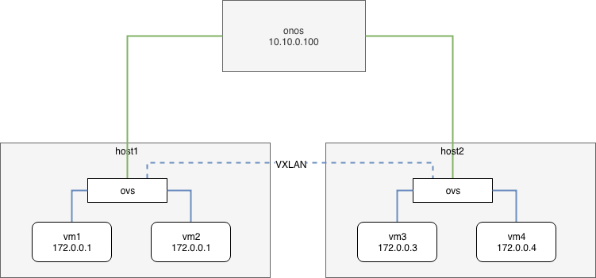
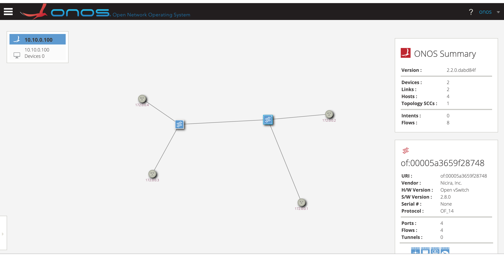

## 目标
> 本节部署两台host，分别连接到onos，并且在两台host中创建vxlan，观察onos对其的处理

拓扑如下



## build image

```
git clone https://github.com/cao19881125/ovn_lab.git
cd ovn_lab
docker build -t ovn_lab:v1 .
```


## run container

```
cd ovn_lab/lesson/list/lesson9_onos_ovs
./start_compose.sh
```

## 构建host1

```
docker exec -it ovs-host1 bash
start_ovs.sh
/root/ovn_lab/create_topo_host1.sh
```

## 构建host2


```
docker exec -it ovs-host2 bash
start_ovs.sh
/root/ovn_lab/create_topo_host2.sh
```

## 测试
- vm1 ping vm2

```
# ip netns exec vm1 ping 172.0.0.2
PING 172.0.0.2 (172.0.0.2) 56(84) bytes of data.
64 bytes from 172.0.0.2: icmp_seq=1 ttl=64 time=34.5 ms
64 bytes from 172.0.0.2: icmp_seq=2 ttl=64 time=9.73 ms
```

- vm1 ping vm3

```
# ip netns exec vm1 ping 172.0.0.3
PING 172.0.0.3 (172.0.0.3) 56(84) bytes of data.
64 bytes from 172.0.0.3: icmp_seq=1 ttl=64 time=40.6 ms
64 bytes from 172.0.0.3: icmp_seq=2 ttl=64 time=0.564 ms
```

- vm1 ping vm4

```
# ip netns exec vm1 ping 172.0.0.4
PING 172.0.0.4 (172.0.0.4) 56(84) bytes of data.
64 bytes from 172.0.0.4: icmp_seq=1 ttl=64 time=45.2 ms
64 bytes from 172.0.0.4: icmp_seq=2 ttl=64 time=1.39 ms
```

## 查看onos ui
http://192.168.184.128:8181/onos/ui/#/topo2


